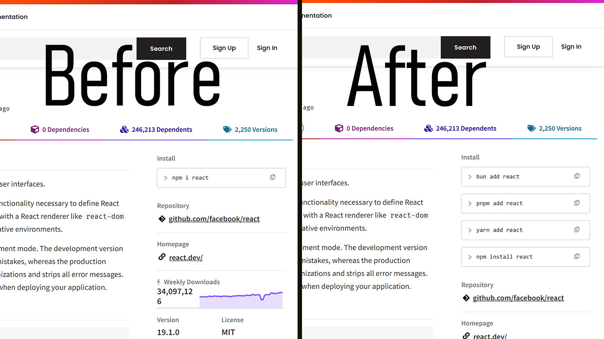

<div style="display: flex; align-items: center; justify-content: center;
flex-direction: column;
gap: 10px;">
    
    <h1>AltPkg</h1>

</div>

## What is this?

This is a browser extension that allows you to customize the `npm install` command on npmjs.com

# WAITING FOR APPROVAL ON EXTENSION STORES

Until then, you can build the extension from source and load it unpacked in your browser. I will update this README once the extension is approved on the stores.

<div>
    
</div>

## Features

- Override the default `npm install` script.
- Use multiple package managers (npm, yarn, pnpm, bun or a custom command)
- Super lightweight and easy to use.

## Please consider donating

Donations are greatly appreciated and help me to keep this project alive.

[Click here to donate](https://uncore.me/donate)

## Installation

Available on major browsers:

<div style="display: flex; flex-direction: column; gap: 10px;">

  <a href="https://chrome.google.com/webstore/detail/npm-install-customizer/nhjgjjgjjgjgjgjgjgjgjgjg" style="display: flex; align-items: center; gap: 10px; text-decoration: none;">
    
    Chrome Web Store
  </a>

  <a href="https://addons.mozilla.org/firefox/addon/npm-install-customizer/" style="display: flex; align-items: center; gap: 10px; text-decoration: none;">
    
    Firefox Add-ons
  </a>

  <a href="https://microsoftedge.microsoft.com/addons/detail/npm-install-customizer/nhjgjjgjjgjgjgjgjgjgjgjg" style="display: flex; align-items: center; gap: 10px; text-decoration: none;">
    
    Microsoft Edge Add-ons
  </a>

</div>

## Build from source:

This extension is built using WXT, a lightweight framework for building browser extensions. To build the extension from source, follow these steps:

```bash
# Clone the repository
git clone https://github.com/uncor3/alt-pkg.git
cd alt-pkg
# Install dependencies
bun install
# Build the extension
# Will default to chrome if no argument is provided
bun run build
```

Then on your browser, go to the extensions page and enable developer mode. Click on "Load unpacked" and select the correct browser folder from `.output` folder inside the cloned repository.

You can also build the extension for a specific browser by providing the browser name as an argument:

```bash
# Build for Firefox
bun wxt build -b firefox
```

## Development

To start the development server, run:

```bash
## Defaults to chrome
bun dev
```

## Contributing

If you want to contribute to this project, feel free to open an issue or a pull request.

### Things that this project needs:

- Tests for the extension, currently there are no tests for the extension.

- A workflow to push the extension to the Chrome Web Store and Firefox Add-ons and etc

- A workflow for versioning and making releases

- Content script can be optimized more to avoid layout shifts
- There is currently no way to edit a custom command after it has been added. It can only be deleted
